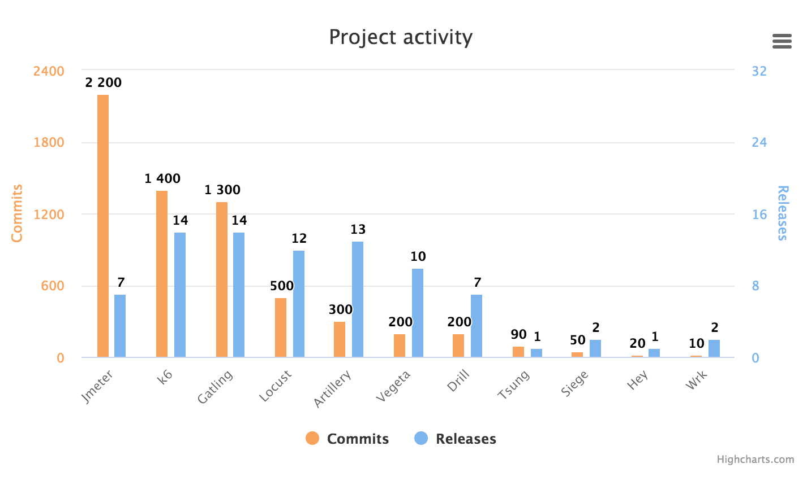
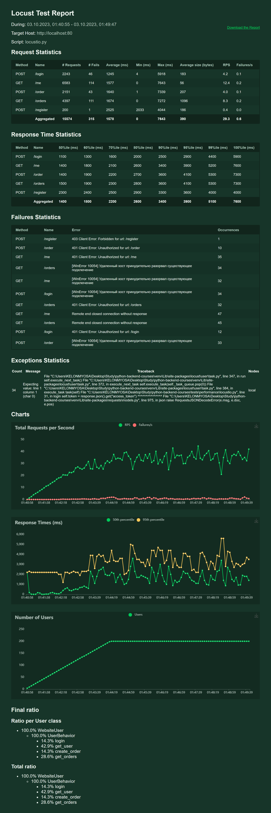

# Performance tests

## Hardware

```
123
```

## Locust

> Locust - это библиотека на языке Python для тестирования производительности, которая предлагает несколько преимуществ:
> 1. Простота использования: Locust предлагает простой и понятный синтаксис на Python, что делает его доступным для широкого круга разработчиков и тестировщиков.
> 2. Масштабируемость: Locust позволяет создавать тысячи виртуальных пользователей, которые могут одновременно выполнять тестовые сценарии, демонстрируя поведение настоящих пользователей.
> 3. Гибкость и настраиваемость: Locust обладает гибкой архитектурой, позволяющей настраивать различные параметры и поведение тестовых сценариев.
> 4. Расширяемость: Locust предоставляет API для расширения его функциональности путем добавления пользовательских классов и методов.
> 5. Отчетность и мониторинг: Locust предлагает детальную отчетность о производительности, включая метрики времени ответов, количества запросов и ошибок, а также интегрируется с популярными инструментами мониторинга.
> 6. Автоматизация: Locust может быть легко интегрирован в CI/CD процессы для автоматического захвата нагрузки и тестирования производительности во время разработки.
> 
> В целом, преимущества библиотеки Locust состоят в ее простоте использования, масштабируемости, гибкости, расширяемости, отчетности и возможности автоматизации процесса тестирования производительности.

## k6

> k6 - это быстрый, гибкий и современный инструмент для производительного тестирования нагрузки и перформанса веб-приложений. Он имеет следующие преимущества:
> 1. Простая установка и использование: k6 доступен для скачивания из командной строки и легко настраивается для запуска тестов.
> 2. Большая гибкость: k6 позволяет использовать JavaScript для написания тестов, что делает его гибким инструментом, способным адаптироваться к различным сценариям и требованиям.
> 3. Возможность создания сложных сценариев: k6 предоставляет мощную библиотеку функций для создания сложных сценариев, включая возможность отправки HTTP-запросов, создания тестовых пользователей и обработки данных.
> 4. Большая производительность: k6 разработан для обеспечения высокой производительности и способен справляться с большими нагрузками.
> 5. Автоматическое масштабирование: k6 поддерживает автоматическую масштабируемость и может запускать тесты на разных уровнях нагрузки, чтобы оценить производительность системы в различных условиях.
> 6. Хорошая документация и сообщество: k6 имеет хорошо поддерживаемую документацию и активное сообщество, которое может помочь в решении любых проблем и предоставить рекомендации по использованию инструмента.

## Comparison

| **TOOL**                    |                 **GATLING**                |                **JMETER**                |                  **K6**                  |                 **LOCUST**                 |
|-----------------------------|:------------------------------------------:|:----------------------------------------:|:----------------------------------------:|:------------------------------------------:|
| Created by                  |                Gatling Corp                |             Apache foundation            |                Load Impact               |               Jonathan Heyman              |
| License                     |                 Apache 2.0                 |                Apache 2.0                |                   AGPL3                  |                     MIT                    |
| Written in                  |                    Scala                   |                   Java                   |                    Go                    |                   Python                   |
| Scriptable                  |                 Yes: Scala                 |               Limited (XML)              |                  Yes: JS                 |                 Yes: Python                |
| Multithreaded               |                     Yes                    |                    Yes                   |                    Yes                   |                     No                     |
| Distributed load generation |                No (Premium)                |                    Yes                   |               No (Premium)               |                     Yes                    |
| Website                     |          [gatling.io](gatling.io)          |  [jmeter.apache.org](jmeter.apache.org)  |              [k6.io](k6.io)              |           [locust.io](locust.io)           |
| Source code                 | [Link](https://github.com/gatling/gatling) | [Link](https://github.com/apache/jmeter) | [Link](https://github.com/loadimpact/k6) | [Link](https://github.com/locustio/locust) |

<p align="center">
  
</p>

## How to start

### locust (using venv)
```
locust -f tests/performance/locustio.py --host=http://localhost:80
```

### k6 (using cmd)
```
k6.exe run <project_path>/tests/performance/k6.js
```

## Reports

### Locust

<p align="center">
  
</p>

### k6

```

          /\      |‾‾| /‾‾/   /‾‾/
     /\  /  \     |  |/  /   /  /
    /  \/    \    |     (   /   ‾‾\
   /          \   |  |\  \ |  (‾)  |
  / __________ \  |__| \__\ \_____/ .io

  execution: local
     script: C:\Users\KELONMYOSA\Desktop\Study\python-backend-courses\tests\performance\k6.js
     output: -

  scenarios: (100.00%) 1 scenario, 200 max VUs, 4m20s max duration (incl. graceful stop):
           * default: Up to 200 looping VUs for 3m50s over 3 stages (gracefulRampDown: 30s, gracefulStop: 30s)


     █ setup

       ✓ status was 200

     █ user

       ✓ status was 200

     checks.........................: 100.00% ✓ 3901      ✗ 0
     data_received..................: 324 MB  1.3 MB/s
     data_sent......................: 1.0 MB  3.9 kB/s
     group_duration.................: avg=24.75s   min=12.27s   med=23.58s   max=41.01s   p(90)=37.83s   p(95)=39.31s
     http_req_blocked...............: avg=81.67µs  min=0s       med=0s       max=1ms      p(90)=531.59µs p(95)=544.1µs
     http_req_connecting............: avg=74.32µs  min=0s       med=0s       max=1ms      p(90)=528.29µs p(95)=542.79µs
     http_req_duration..............: avg=3.31s    min=1.06ms   med=2.35s    max=21.13s   p(90)=8.45s    p(95)=15.37s
       { expected_response:true }...: avg=3.31s    min=1.06ms   med=2.35s    max=21.13s   p(90)=8.45s    p(95)=15.37s
     http_req_failed................: 0.00%   ✓ 0         ✗ 3901
     http_req_receiving.............: avg=112.72ms min=0s       med=150.41ms max=596.89ms p(90)=234.83ms p(95)=275.19ms
     http_req_sending...............: avg=17.78µs  min=0s       med=0s       max=1ms      p(90)=0s       p(95)=0s
     http_req_tls_handshaking.......: avg=0s       min=0s       med=0s       max=0s       p(90)=0s       p(95)=0s
     http_req_waiting...............: avg=3.19s    min=504.8µs  med=2.17s    max=21.13s   p(90)=8.27s    p(95)=15.34s
     http_reqs......................: 3901    15.126425/s
     iteration_duration.............: avg=27.5s    min=179.08ms med=26.42s   max=44.02s   p(90)=40.25s   p(95)=42.28s
     iterations.....................: 929     3.602268/s
     vus............................: 7       min=1       max=200
     vus_max........................: 200     min=200     max=200


running (4m17.9s), 000/200 VUs, 929 complete and 52 interrupted iterations
default ✓ [======================================] 000/200 VUs  3m50s
```