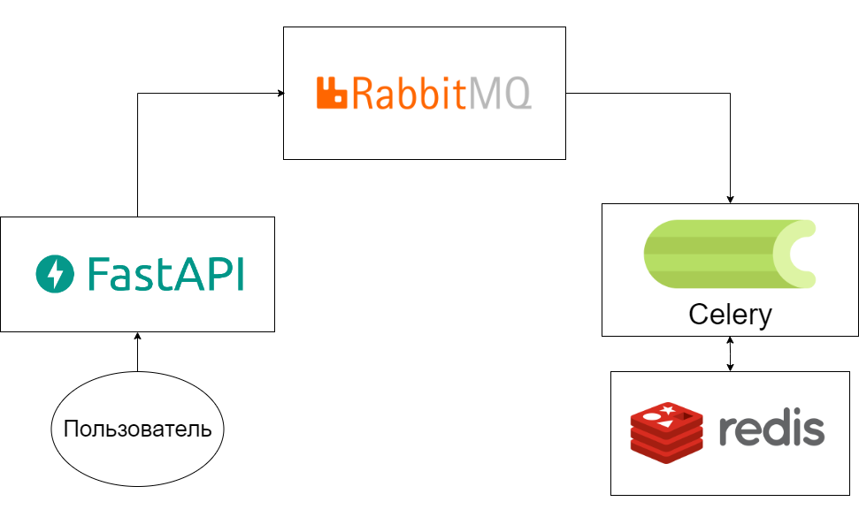

# Homework 4

> Business scenario:
>
> We have an online store, and orders may require lengthy processing, and we do not want the user to expect a result. 
> Orders are processed asynchronously using Celery and RabbitMQ.

## How to start

```
docker compose up -d
```

## FastAPI arguments

- Host - <code>localhost</code>
- Port - <code>80</code>
- Docs URL - <code>/docs</code>

## Architecture

<p align="center">
  
</p>